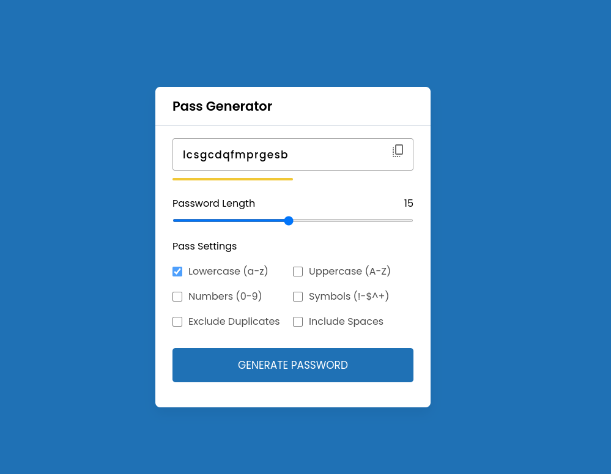
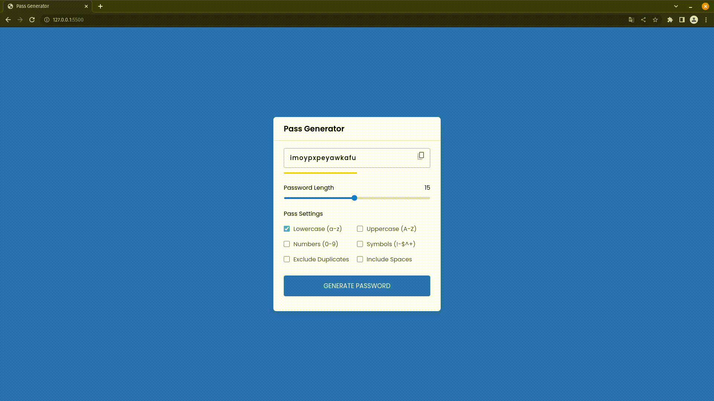

<h1 align="center"> Password Generator </h1>

<p align="center">
  A simple password generator with the option to copy the generated password<br/>
</p>

<p align="center">
  <a href="#-how-to-use">How to Use</a>&nbsp;&nbsp;&nbsp;|&nbsp;&nbsp;&nbsp;
  <a href="#-license">License</a>
</p>

<p align="center">
  
</p>

<br>

<p align="center">
  
</p>

<br>

<p align="center">
  
</p>

## 🛠️ How to Use
Clone this repo with the following command:

```bash
git clone https://github.com/rafael-gomes/pass-generator.git
```
After clone, open the index.html on browser and enjoy it.

## 📝 License

This project is under MIT License